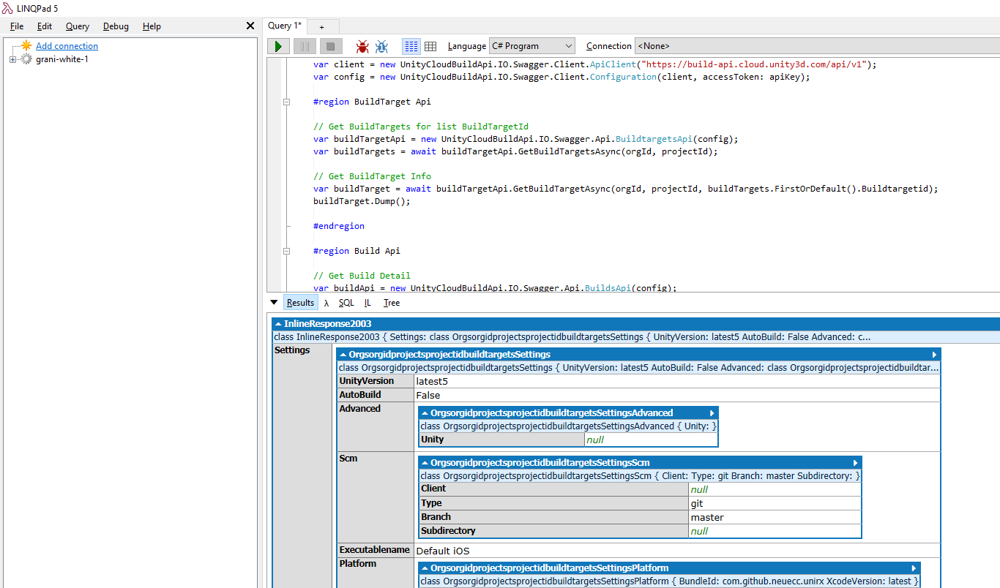

UnityCloudbuildApi based on auto generated Swagger API of [Unity Cloud Build API reference](https://build-api.cloud.unity3d.com/docs/1.0.0/index.html).

Swagger API could create Client code by https://generator.swagger.io/, and this project base is created with https://build-api.cloud.unity3d.com/api/v1/api.json.

What for
-----

C# Client for [Unity Cloud Build](https://build.cloud.unity3d.com).

You can control all build action with this client.

